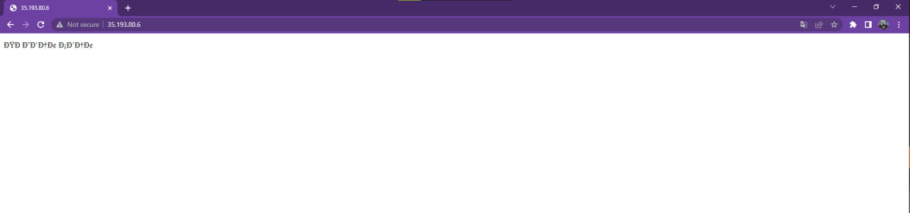
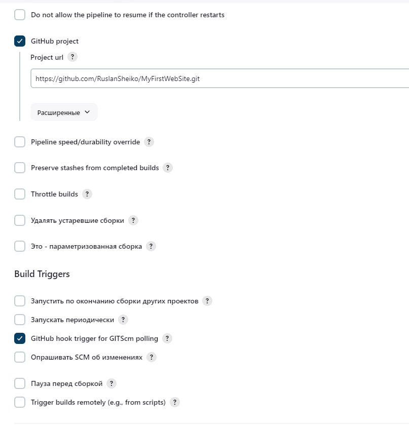
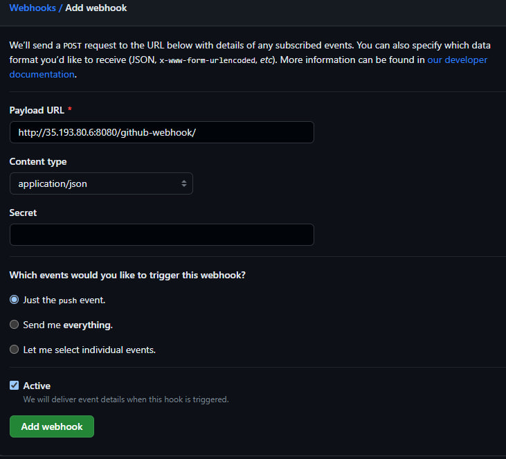
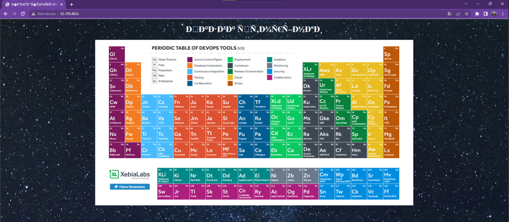

+ Мета роботи

Метою проекту є максимальна автоматизація процесу створення віртуальної машини за допомогою Terraform та використання CI/CD для автоматизації хостингу веб-сайту. 

+ Початок роботи

Знову виконуємо створення віртуальної машини за допомогою Terraform, що вже було зроблено в минулій лабораторній роботі. Код для цієї частини наступний:

```
terraform {
  required_providers {
    google = {
      source = "hashicorp/google"
      version = "4.51.0"
    }
  }
}

provider "google" {
  credentials = file(var.credentials_file)
  project = var.project
  region  = var.region
  zone    = var.zone
}

resource "google_compute_network" "vpc_network" {
  name = "rgr-network"
}


resource "google_compute_instance" "vm_instance" {
  name         = "rgr-instance"
  machine_type = "e2-micro"
  tags = ["devops", "git", "terraform", "khai", "university", "website", "rgr" ]
  
  boot_disk {
    initialize_params {
      image = "debian-cloud/debian-11"
    }
  }

  network_interface {
    network = google_compute_network.vpc_network.name
    access_config {
    }
  }
}
resource "google_compute_firewall" "firewall_rules" {
  project       = var.project
  name          = "rgr-firewall-rule"
  network       = google_compute_network.vpc_network.name
  source_ranges = ["0.0.0.0/0"]

  allow {
    protocol = "tcp"
    ports = ["22", "8080"]
  }
}
```
+ Останній конфігураційний блок використовується для створення правила брандмауера для відкриття портів 22 (для підключення до віртуальної машини через SSH) та 8080 (для роботи Jenkins'y) 
+ Код для variables.tf виглядає наступним чином:

```
variable "project" {
    default = "rgr-project-385812"
 }

variable "credentials_file" {
    default = "name.json"
 }

variable "region" {
  default = "us-central1"
}

variable "zone" {
  default = "us-central1-c"
}

variable "subnet-region" {
  default = "us-central1"
}
```

+ Наступним кроком потрібно виконати команду у Windows PowerShell:

```
terraform apply 
```

+ Наші подальші дії:

```
sudo apt update
sudo apt install git
sudo apt install openjdk-17-jre
```

+ Інструкція щодо встановлення Jenkins:

```
curl -fsSL https://pkg.jenkins.io/debian/jenkins.io-2023.key | sudo tee \
  /usr/share/keyrings/jenkins-keyring.asc > /dev/null

echo deb [signed-by=/usr/share/keyrings/jenkins-keyring.asc] \
  https://pkg.jenkins.io/debian binary/ | sudo tee \
  /etc/apt/sources.list.d/jenkins.list > /dev/null

sudo apt-get update

sudo apt-get install jenkins
```

+ Далі треба взяти external ip-адресу машини та через двокрапку вписати порт 8080. Під'єднуємось до Jenkins'y, при першому з'єднанні потрібно ввести пароль тому знаходимо його за допомогою команди:

```
sudo cat /var/lib/jenkins/secrets/initialAdminPassword
```

+ Далі створюємо новий репозиторій з якого Jenkins буде брати код. Так як нам необхідно створити вебсайт, встановимо Apache2 web server, використовуючи наступний код:.

```
sudo apt-get install apache2
```

+ Після встановлення одразу можна перевірити його працездатність. Для цього потрібно відкрити external ip-адресу та переконатися в роботоспособності сайту.

+ Наступним нашим кроком буде створення пайплайну. Код наступний:

```
pipeline {
    agent any
    options {
        disableConcurrentBuilds()
    }
    stages {
        stage('Checkout') {
            steps {
                checkout scmGit(
                    branches: [[name: 'main']],
                    userRemoteConfigs: [[url: 'https://github.com/RuslanSheiko/MyFirstWebSite.git']])
            }
        }
        stage('Build') {
            steps {
                sh 'sudo cp /var/lib/jenkins/workspace/RGR/* /var/www/html/'
            }
        }
    }
}
```

+ Також у віртуальній машині надаємо права Jenkins. З використанням наступної команди:

```_
sudo visudo
```

+ В цьому файлі потрібно дописати jenkins наступним чином:

```
# User privilege specification
root    ALL=(ALL:ALL) ALL
jenkins ALL=NOPASSWD: ALL
```

+ Зберігаємо та запускаємо Jenkins. Збираємо та вже можна поглянути на отриману сторінку:



+ Далі створюємо вебхук, який запускатиме збирання при кожному оновленні репозиторію. В Jenkins ставимо галку на GitHub hook trigger for GITScm polling. Та вказуємо адресу GitHub. Результат наступний:



+ Також потрібно налаштувати сам репозиторій. Треба створити новий вебхук, вказавши адресу Jenkins, а ткож додаємо /github-webhook/ до адреси. Content type обираємо application/json. Подія, яка викликає вебхук - push. Налаштування виглядають наступним чином:



+ Тепер виконаємо перевірку вебхуку. Створимо новий сайт, запушимо його в репозиторій, а після цього потрібно дивитися на відкритий нами сайт. Результат:



+ Висновки

У розрахунково-графічній роботі було опрацьовано та протестовано роботу з автоматизацією створення віртуальних машин. Розглянуто та опрацьовано роботу з Jenkins та створення вебхуків. В результаті нам вдалося автоматизувати процес оновлення вебсайту при зміні репозиторію. 